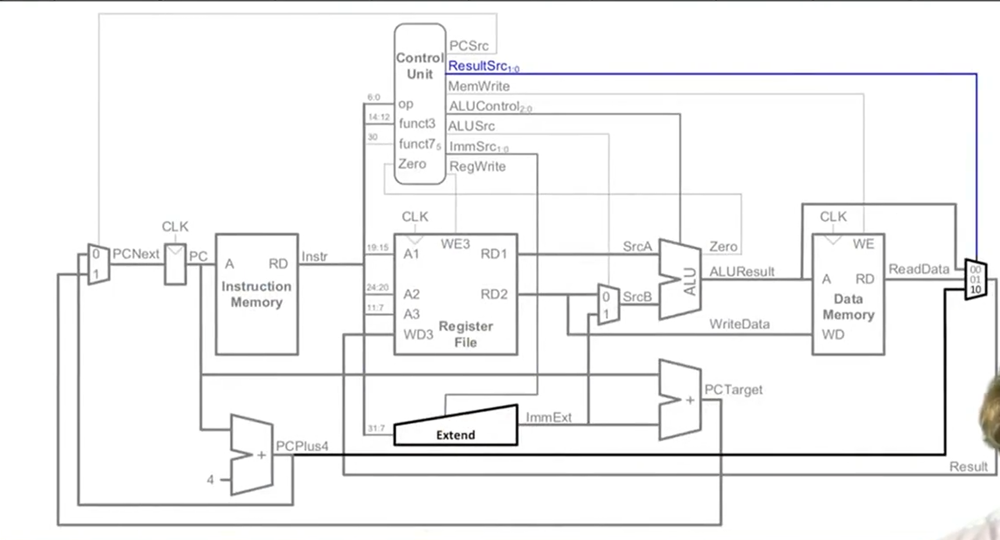
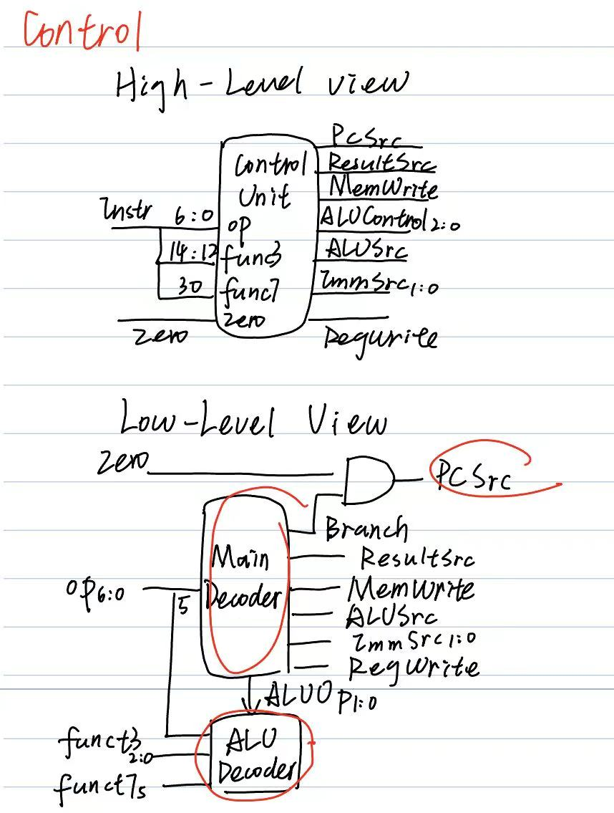
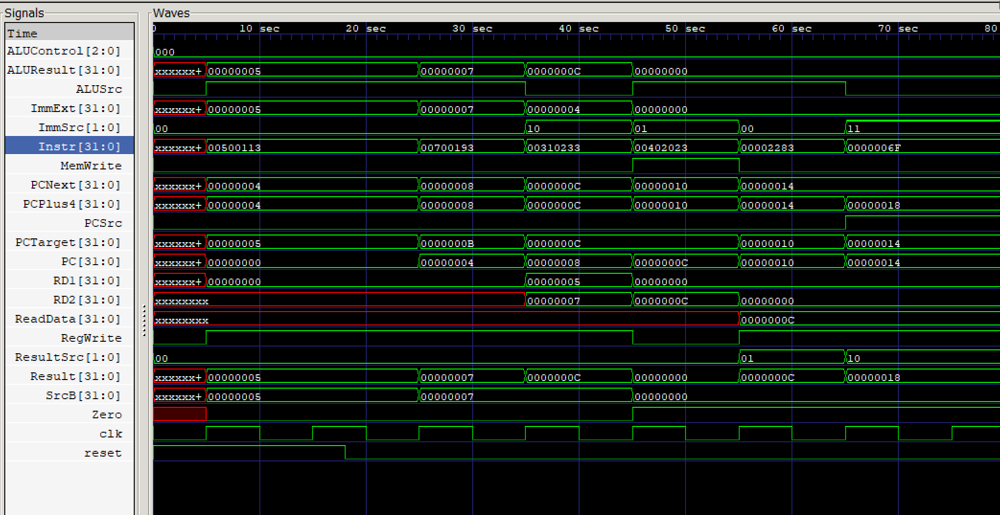

# My first RISC-V Single-cycle CPU

## Description
基于SystemVerilog实现的单周期RISC-V处理器核心

## Supported Instructions
目前实现了基础指令包括add, addi, jal, beq, lw, sw等

## Architecture/Design
核心控制逻辑与数据通路基于Harvey Mudd College的计算机体系结构相关课程的真值表设计




## File Structure
- top_module.sv: 顶层连线模块
- control.sv: 控制单元
- alu.sv: 算术逻辑单元
- regfile.sv/imem.sv/dmem.sv: 寄存器堆与指令/数据内存
- mux2.sv/mux4.sv：2选1/4选1的多路选择器
- pc.sv: PC程序计数器
- tb_top.sv: testbench
- memfile.dat: 包含十六进制机器码的测试程序

## How to run
依赖工具：Icarus Verilog, GTKWave

```
iverilog -g2012 -o cpu.out *.sv
vvp cpu.out
gtkwave cpu_wave.vcd
```

## Result

测试程序成功执行了加法运算并将结果写入数据内存
